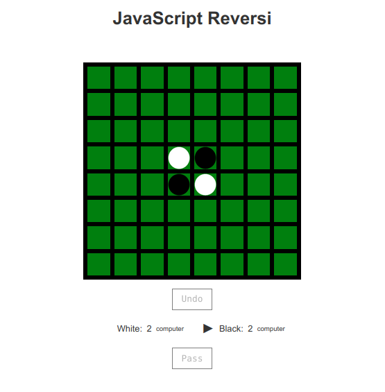

# JavaScript Chess: Modern Uyarlama

Bu proje, David Bau tarafından 2009 yılında geliştirilen klasik Reversi (Othello) oyununun kod tabanını kullanarak oluşturulmuş bir satranç uyarlamasıdır. Orijinal Reversi'nin arayüz ve yapay zeka altyapısı korunarak tamamen işlevsel bir satranç oyununa dönüştürülmüştür.



## Özellikler
- **Modern JavaScript:** ES6+ söz dizimi (sınıflar, arrow fonksiyonlar, `const`/`let`).
- **AI Algoritması:** Reversi'den uyarlanmış derinlik tabanlı arama ve minimax optimizasyonu.
- **Satranç Kuralları:** Piyon, at, fil, kale, vezir ve şah hamleleri (rok ve geçerken alma hariç).
- **Responsive Tasarım:** Mobil cihazlara uyumlu arayüz.
- **Oyun İçi Kontroller:** Geri alma/tekrarla, renk seçimi.
- **URL Parametreleri:** `small`, `white`, `quiet` gibi özelleştirmeler.

---

## Kronoloji

### **Ağustos 2009** - İlk Reversi Yayını
- David Bau, orijinal JavaScript Reversi kodunu [kişisel blogunda](http://davidbau.com/archives/2009/08/23/javascript_reversi.html) paylaştı.

### **Mart 2026** - Satranç Uyarlaması
- Reversi kod tabanı satranca dönüştürüldü:
  - `Board` sınıfı `ChessBoard` olarak yeniden yazıldı.
  - Tüm taş hareketleri ve satranç kuralları eklendi.
  - Görsel öğeler (resimler) yerine Unicode satranç emojileri kullanıldı (♙♘♗♖♕♔ / ♟♞♝♜♛♚).
  - AI değerlendirme fonksiyonu materyal ve pozisyonel skor tabloları ile güncellendi.
  - Hamle seçimi için tıklama mantığı eklendi (taş seç -> hedefe tıkla).
  - Orijinal Reversi arayüzü, butonlar ve sayaç sistemi aynen korundu.

---

## Kurulum
1. Repoyu klonlayın:
   ```bash
   git clone https://github.com/metatronslove/chess.git
   ```
   (Not: Proje adı reversi kalmıştır, ancak içerik satrançtır.)
2. Tarayıcıda `index.html` dosyasını açın.
3. (İsteğe bağlı) `assets/` klasörü eski Reversi görsellerini içerir, kullanılmamaktadır.

## Oynatma Talimatları
- **Taş Seçme:** Kendi taşınıza tıklayın (seçili kare sarı renkle vurgulanır).
- **Taş Hareketi:** Seçili taşla gitmek istediğiniz hedef kareye tıklayın.
- **Renk Seçimi:** "White" veya "Black" etiketlerine tıklayarak bilgisayarın rengini değiştirin.
- **Kontroller:**
  - `Undo`: Son hamleyi geri al.
  - `Resign`: Oyunu terk et (henüz tam destek yok, Yeni Oyun başlatır).
  - `New Game`: Oyun bittiğinde yeni oyun başlatır.

## Teknik Detaylar
- **AI Algoritması:** Derinlik tabanlı arama (orijinal Reversi mimarisi korunmuştur).
- **Değerlendirme:** Materyal (PIECES_VALUES) + pozisyonel skor tabloları (Piece-Square Tables).
- **Hamle Üretimi:** Tüm taşlar için yasal hamleler (rok ve geçerken alma hariç, piyon terfisi varsayılan olarak vezir).
- **Zaman Yönetimi:** Dinamik zaman aşımı (`setTimeout` ile AI düşünme süresi).

---

## Katkıda Bulunanlar
- **David Bau**: Orijinal Reversi kodu ve algoritma mimarisi.
- **[metatronslove]**: Satranç uyarlaması, emoji entegrasyonu ve dokümantasyon.

## Lisans
MIT Lisansı altında dağıtılmaktadır. Detaylar için [LICENSE](LICENSE) dosyasına bakın.

---

## ☕ Destek Olun / Support

Projemi beğendiyseniz, bana bir kahve ısmarlayarak destek olabilirsiniz!

[](https://buymeacoffee.com/metatronslove)

Teşekkürler! 🙏

**Not:** Orijinal Reversi kodu ve tarihçe için [David Bau'nun makalesini](http://davidbau.com/archives/2009/08/23/javascript_reversi.html) ziyaret edin.
